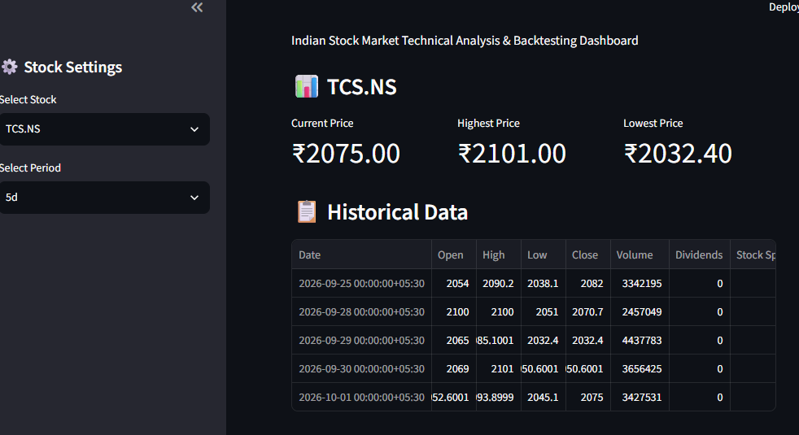

# 🇮🇳 AlgoTrade India

### Indian Stock Market Technical Analysis & Historical Backtesting Dashboard

AlgoTrade India is an interactive **Python + Streamlit** application for analyzing Indian stock-market data using technical indicators and evaluating a rule-based trading strategy through historical backtesting.

The project combines **market data, technical analysis, trading signals, portfolio simulation, and performance metrics** into a single interactive dashboard.

> ⚠️ **Disclaimer:** This project is created for educational and software-development purposes. It uses historical market data and does not provide financial advice, investment recommendations, or live trading execution.

---

## 🚀 Live Demo

**Coming soon**

The Streamlit application will be deployed after the GitHub release.

---

## 📸 Dashboard Preview

Add your application screenshot here after deployment:

```text
docs/dashboard.png
```

You can later replace this section with:

```markdown

```
# 🖥️ Dashboard

## Market Overview


## Price & Moving Averages


## RSI


## Backtest Performance


## MACD


---

# 📌 Project Overview

AlgoTrade India allows users to:

- Select an Indian stock
- Load historical market data
- Calculate technical indicators
- Generate rule-based BUY / SELL / HOLD signals
- Simulate historical trades
- Track portfolio value
- Calculate performance metrics
- Compare the strategy against Buy & Hold
- Analyze drawdowns and winning trades
- Explore trade history and historical signals

The project is designed as a practical demonstration of:

**Python + Data Analysis + Financial Data + Algorithmic Trading Concepts + Backtesting + Streamlit**

---

# ✨ Features

## 📈 Historical Market Data

The application retrieves historical stock-market data using `yfinance`.

Supported examples include:

- `RELIANCE.NS`
- `TCS.NS`
- `INFY.NS`
- `HDFCBANK.NS`
- `ICICIBANK.NS`
- `SBIN.NS`
- `ITC.NS`
- `TATAMOTORS.NS`

Users can select different historical periods:

- 6 Months
- 1 Year
- 2 Years
- 5 Years

---

# 📊 Technical Indicators

AlgoTrade India currently uses three major technical indicators.

## 1. Simple Moving Average — SMA

The application calculates:

- SMA 20
- SMA 50

SMA is calculated using:

```text
SMA = Sum of Closing Prices / Number of Periods
```

The relationship between SMA20 and SMA50 is used as one component of the trading strategy.

---

## 2. Relative Strength Index — RSI

RSI measures the recent strength of price movements.

The project uses a standard:

```text
14-period RSI
```

RSI ranges between:

```text
0 → 100
```

The dashboard displays:

- 70 — Overbought reference
- 50 — Neutral reference
- 30 — Oversold reference

The strategy also uses RSI as one of its signal-confirmation conditions.

---

## 3. MACD

The project calculates:

- MACD
- Signal Line
- MACD Histogram

The MACD is calculated using:

```text
MACD = EMA(12) - EMA(26)
```

The signal line is:

```text
Signal = EMA(9) of MACD
```

The histogram is:

```text
Histogram = MACD - Signal
```

The dashboard visualizes all three components.

---

# 🎯 Trading Strategy

AlgoTrade India currently uses a simple rule-based strategy combining:

- SMA
- RSI
- MACD

## 🟢 BUY Condition

A BUY signal is generated when:

```text
SMA20 > SMA50
AND
RSI > 50
AND
MACD > MACD Signal
```

This means the strategy requires confirmation from all three indicators.

---

## 🔴 SELL Condition

A SELL signal is generated when:

```text
SMA20 < SMA50
OR
RSI < 40
OR
MACD < MACD Signal
```

The strategy is intentionally simple so that its behavior can be easily understood and analyzed.

---

## 🟡 HOLD

If neither the BUY nor SELL condition is satisfied:

```text
Signal = HOLD
```

---

# 🧪 Backtesting Engine

The project includes a historical backtesting engine that simulates trading using past market data.

The backtester starts with user-defined capital, for example:

```text
₹100,000
```

It then processes historical signals and simulates:

- Buying shares
- Holding shares
- Selling shares
- Remaining cash
- Portfolio value
- Transaction costs

---

# ⏭️ Avoiding Look-Ahead Bias

One important design decision in the project is avoiding same-day execution.

Instead of doing:

```text
Today's Signal
        ↓
Today's Closing Price
```

the backtester uses:

```text
Today's Signal
        ↓
Next Trading Day's Open
        ↓
Execute Trade
```

This prevents the backtest from using information from the same trading day's close to pretend that a trade could have been executed earlier at that day's price.

---

# 💰 Transaction Costs

The backtesting engine includes a simplified transaction cost:

```text
0.10% per trade
```

This means the simulation does not assume that trading is completely free.

The transaction-cost model is intentionally simplified and does not attempt to reproduce every real-world NSE brokerage, STT, GST, exchange fee, stamp duty, or slippage component.

---

# 📊 Performance Metrics

The dashboard calculates several performance metrics.

## Initial Capital

The amount of capital used to start the simulation.

Example:

```text
₹100,000
```

---

## Final Portfolio Value

The portfolio value at the end of the selected historical period.

---

## Strategy Return

```text
Strategy Return =
(Final Portfolio Value - Initial Capital)
/
Initial Capital × 100
```

---

## Buy & Hold Return

The project also calculates a simple Buy & Hold return for comparison.

This provides a baseline for evaluating the historical result of the rule-based strategy.

---

## Maximum Drawdown

Maximum drawdown measures the largest decline from a previous portfolio peak.

Conceptually:

```text
Drawdown =
(Current Portfolio Value / Previous Peak) - 1
```

The dashboard reports the largest negative drawdown observed during the backtest.

---

## Win Rate

Win rate is calculated using completed BUY → SELL trade pairs.

```text
Win Rate =
Winning Trades
/
Completed Trades × 100
```

---

## Transaction Costs

The dashboard also displays the total simulated transaction costs incurred during the backtest.

---

# 🖥️ Dashboard

The Streamlit dashboard contains:

### 📊 Market Overview

Displays:

- Current Price
- Current RSI
- Strategy Return
- Final Portfolio Value

### 🎯 Current Trading Signal

Displays the latest:

- BUY
- SELL
- HOLD

signal generated by the strategy.

### 📈 Price Chart

Displays:

- Closing price
- SMA20
- SMA50
- BUY markers
- SELL markers

### 📊 RSI Chart

Displays:

- RSI
- 70 reference level
- 50 reference level
- 30 reference level

### 📉 MACD Chart

Displays:

- MACD
- Signal Line
- Histogram
- Zero line

### 💰 Portfolio Performance

Shows how the simulated portfolio value changed throughout the historical period.

### 📊 Performance Statistics

Displays:

- Strategy Return
- Buy & Hold Return
- Win Rate
- Maximum Drawdown
- Completed Trades
- Final Portfolio Value
- Transaction Costs

### 📜 Trade History

Displays simulated BUY and SELL transactions.

### 📋 Recent Trading Signals

Shows the most recent indicator values and generated signals.

---

# 🏗️ Project Architecture

The project follows a modular structure.

```text
                    ┌─────────────────────┐
                    │   Yahoo Finance     │
                    │   Historical Data   │
                    └──────────┬──────────┘
                               │
                               ▼
                    ┌─────────────────────┐
                    │    Data Cleaning    │
                    └──────────┬──────────┘
                               │
                               ▼
                    ┌─────────────────────┐
                    │    Indicators       │
                    │                     │
                    │  SMA20 / SMA50      │
                    │  RSI                │
                    │  MACD               │
                    └──────────┬──────────┘
                               │
                               ▼
                    ┌─────────────────────┐
                    │ Trading Strategy    │
                    │                     │
                    │ BUY / SELL / HOLD   │
                    └──────────┬──────────┘
                               │
                               ▼
                    ┌─────────────────────┐
                    │     Backtester      │
                    │                     │
                    │ Next-Day Execution  │
                    │ Transaction Costs   │
                    └──────────┬──────────┘
                               │
                               ▼
                    ┌─────────────────────┐
                    │ Performance Metrics │
                    │                     │
                    │ Return              │
                    │ Drawdown            │
                    │ Win Rate            │
                    └──────────┬──────────┘
                               │
                               ▼
                    ┌─────────────────────┐
                    │ Streamlit Dashboard │
                    └─────────────────────┘
```

---

# 📂 Project Structure

```text
algotrade-india/
│
├── src/
│   ├── __init__.py
│   ├── data.py
│   ├── indicators.py
│   ├── strategy.py
│   ├── backtest.py
│   └── metrics.py
│
├── notebooks/
│
├── tests/
│
├── app.py
├── README.md
├── .gitignore
├── .python-version
├── pyproject.toml
└── uv.lock
```

---

# 🧩 Module Explanation

## `app.py`

The main Streamlit application.

Responsible for:

- User interface
- Stock selection
- Period selection
- Dashboard visualization
- Running the complete pipeline

---

## `src/data.py`

Responsible for retrieving historical market data.

---

## `src/indicators.py`

Contains technical indicator calculations:

```text
calculate_sma()
calculate_rsi()
calculate_macd()
```

---

## `src/strategy.py`

Contains the rule-based trading strategy.

Responsible for generating:

```text
BUY
SELL
HOLD
```

signals.

---

## `src/backtest.py`

Contains the historical trading simulation.

Responsible for:

- Trade execution
- Cash management
- Share management
- Transaction costs
- Portfolio value
- Trade history

---

## `src/metrics.py`

Calculates:

- Strategy return
- Buy & Hold return
- Win rate
- Maximum drawdown
- Completed trades
- Transaction costs
- Final portfolio value

---

# 🛠️ Tech Stack

| Technology | Purpose |
|---|---|
| Python | Core programming language |
| Pandas | Data manipulation |
| NumPy | Numerical operations |
| yfinance | Historical market data |
| Plotly | Interactive charts |
| Streamlit | Web dashboard |
| uv | Python environment & dependency management |
| Git | Version control |
| GitHub | Source code hosting |

---

# ⚙️ Installation

## 1. Clone the Repository

```bash
git clone https://github.com/YOUR_USERNAME/algotrade-india.git
```

Move into the project:

```bash
cd algotrade-india
```

---

# 🐍 Using uv

This project uses `uv` for Python environment and dependency management.

Install dependencies:

```bash
uv sync
```

---

# ▶️ Run the Application

Start Streamlit:

```bash
uv run streamlit run app.py
```

The application will open in your browser.

---

# 🔧 Alternative Python Setup

If you are not using `uv`, you can create a virtual environment:

```bash
python -m venv .venv
```

Activate it on Windows:

```bash
.venv\Scripts\activate
```

Install dependencies:

```bash
pip install pandas numpy yfinance plotly streamlit
```

Run:

```bash
streamlit run app.py
```

---

# 📊 Example Workflow

A typical workflow looks like:

```text
1. Select stock
       ↓
2. Select historical period
       ↓
3. Set initial capital
       ↓
4. Download historical data
       ↓
5. Calculate indicators
       ↓
6. Generate trading signals
       ↓
7. Run historical backtest
       ↓
8. Calculate performance
       ↓
9. Visualize results
```

---

# 🧠 What I Learned From This Project

This project helped demonstrate practical concepts in:

### Python

- Functions
- Modules
- Data structures
- Exception handling
- Project organization

### Data Analysis

- Pandas DataFrames
- Time-series data
- Rolling calculations
- Missing-value handling
- Data cleaning

### Financial Data

- OHLCV data
- Moving averages
- RSI
- MACD
- Trading signals

### Algorithmic Trading

- Rule-based strategies
- Portfolio simulation
- Position management
- Transaction costs
- Backtesting

### Software Development

- Modular architecture
- Git
- GitHub
- Environment management
- Streamlit application development

---

# ⚠️ Limitations

This project has several important limitations.

### Historical Data

The strategy is evaluated using historical data. Historical performance does not establish future performance.

### Simplified Transaction Costs

The current transaction-cost model uses a simplified percentage and does not represent every real-world trading charge.

### Slippage

The current version does not model realistic market slippage.

### Market Impact

Large orders and their potential impact on market prices are not modeled.

### Strategy Simplicity

The strategy uses a relatively simple combination of technical indicators.

### No Live Trading

The current version does **not** place real orders.

### No Brokerage Integration

There is currently no integration with brokers such as Zerodha, Upstox, Angel One, or other trading platforms.

---

# 🔮 Future Improvements

Possible future versions may include:

## V2

- [ ] More technical indicators
- [ ] Candlestick charts
- [ ] Strategy parameter controls
- [ ] Stop-loss simulation
- [ ] Take-profit simulation
- [ ] Position sizing
- [ ] More detailed transaction-cost modeling
- [ ] Sharpe ratio
- [ ] Sortino ratio
- [ ] CAGR
- [ ] Volatility analysis

## V3

- [ ] Paper trading
- [ ] Broker API integration
- [ ] Portfolio management
- [ ] Watchlist
- [ ] Automated strategy comparison
- [ ] Multiple strategy support

## V4

- [ ] Machine-learning based signals
- [ ] Strategy optimization
- [ ] Advanced risk management
- [ ] Portfolio-level backtesting

---

# 🧪 Backtesting Philosophy

The goal of this project is not to claim that a particular strategy is profitable.

Instead, the project demonstrates how a trading hypothesis can be converted into a reproducible software pipeline:

```text
Trading Idea
     ↓
Rules
     ↓
Historical Data
     ↓
Backtest
     ↓
Performance Metrics
     ↓
Analysis
```

This makes the project useful as a learning exercise in:

**Python + Data Science + Financial Computing + Software Engineering.**

---

# 🔐 Data & Privacy

The application does not require users to provide personal financial information.

Historical market data is retrieved through `yfinance`.

---

# 🤝 Contributing

Contributions and suggestions are welcome.

To contribute:

```bash
git clone https://github.com/YOUR_USERNAME/algotrade-india.git
```

Create a branch:

```bash
git checkout -b feature/new-feature
```

Make your changes and commit:

```bash
git add .
git commit -m "Add new feature"
```

Push:

```bash
git push origin feature/new-feature
```

Then open a Pull Request.

---

# 📜 License

This project can be released under the MIT License.

If you use an MIT License, add a `LICENSE` file containing the standard MIT License text.

---

# 👨‍💻 Author

**Rahul Gehlot**

B.Tech Computer Science & Engineering  
JECRC University

### Areas of Interest

- Python
- Data Science
- Machine Learning
- Artificial Intelligence
- Algorithmic Trading
- Data Analysis
- Software Development

---

# ⭐ If You Find This Project Useful

If this project helped you understand technical analysis, backtesting, or Python financial-data applications, consider giving the repository a ⭐.

---

## ⚠️ Final Disclaimer

AlgoTrade India is an educational software project.

The signals, backtest results, charts, and metrics generated by this application are based on historical data and predefined rules. They should not be interpreted as financial advice or as a recommendation to buy or sell any security.

**Past performance does not guarantee future results.**

---

### Built with ❤️ using Python 🇮🇳